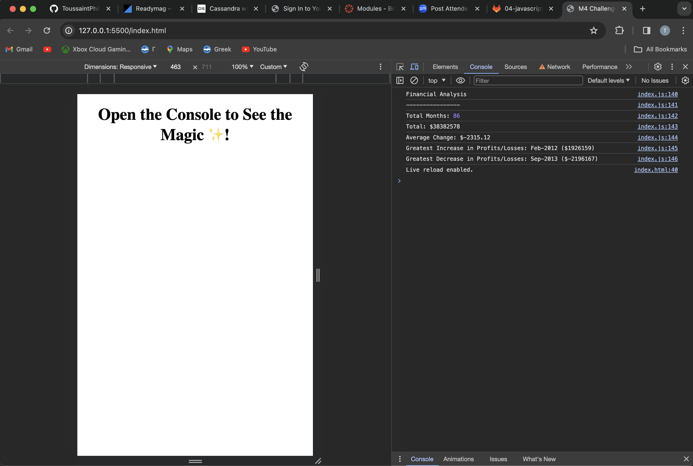

# Console Finances

<a name="readme-top"></a>

<!-- PROJECT LOGO -->
<br />
<div align="center">
  <a href="https://github.com/your-github-username/Console-Finances">
    
  </a>

  <h3 align="center">Console Finances</h3>

  <p align="center">
    A comprehensive financial analysis tool using JavaScript.
    <br />
    <a href="https://github.com/your-github-username/Console-Finances"><strong>Explore the docs »</strong></a>
    <br />
    <br />
    <a href="https://your-github-username.github.io/Console-Finances/">View Demo</a>
    ·
    <a href="https://github.com/your-github-username/Console-Finances/issues">Report Bug</a>
    ·
    <a href="https://github.com/your-github-username/Console-Finances/issues">Request Feature</a>
  </p>
</div>

<!-- TABLE OF CONTENTS -->
<details>
  <summary>Table of Contents</summary>
  <ol>
    <li><a href="#about-the-project">About The Project</a></li>
    <li><a href="#how-it-works">How It Works</a></li>
    <li><a href="#usage">Usage</a></li>
    <li><a href="#output-format">Output Format</a></li>
    <li><a href="#built-with">Built With</a></li>
    <li><a href="#getting-started">Getting Started</a></li>
    <li><a href="#roadmap">Roadmap</a></li>
    <li><a href="#contributing">Contributing</a></li>
    <li><a href="#license">License</a></li>
    <li><a href="#contact">Contact</a></li>
    <li><a href="#acknowledgments">Acknowledgments</a></li>
  </ol>
</details>

<!-- ABOUT THE PROJECT -->
## About The Project




<p align="right">(<a href="#readme-top">back to top</a>)</p>

### How It Works

The Console Finances tool processes financial data in JavaScript. Here's how it operates:

- **Data Processing**: Reads a dataset of financial records (arrays with fields for Date and Profit/Losses).
- **Calculations**: Performs calculations to determine total months, net total of profits/losses, average change, and records the greatest increase and decrease in profits/losses.
- **Results**: Outputs the financial analysis to the console, providing quick insights into financial trends and anomalies.

### Usage

To use Console Finances:

1. **Clone the Repository**: Clone the 'Console-Finances' repository to your local machine.
2. **Prepare Your Data**: Place your financial dataset in the `starter/index.js` file.
3. **Run the Script**: Execute the script in a JavaScript runtime environment or open it in a web browser console to view the analysis.
4. **Review Output**: Analyze the output for financial insights.

### Output Format

The financial analysis will appear in the console in the following format:

```
Financial Analysis 
----------------
Total Months: [Total Months]
Total: $[Net Total]
Average Change: $[Average Change]
Greatest Increase in Profits/Losses: [Month-Year] ($[Amount])
Greatest Decrease in Profits/Losses: [Month-Year] ($[Amount])
```

<p align="right">(<a href="#readme-top">back to top</a>)</p>

### Built With

This project was built using:

* [JavaScript](https://www.javascript.com)

<p align="right">(<a href="#readme-top">back to top</a>)</p>

<!-- GETTING STARTED -->
## Getting Started

To get a local copy up and running, follow these simple steps.

### Prerequisites

No prerequisites are needed for this project.

### Installation

1. Clone the repo
   ```sh
   git clone https://github.com/your-github-username/Console-Finances.git
   ```
2. Open `index.js` in your code editor to view or modify the script.

<p align="right">(<a href

="#readme-top">back to top</a>)</p>

<!-- ROADMAP -->
## Roadmap

- [x] Initial release with core functionalities
- [ ] Implement additional financial analysis features
- [ ] Enhance data visualization

See the [open issues](https://github.com/your-github-username/Console-Finances/issues) for a full list of proposed features (and known issues).

<p align="right">(<a href="#readme-top">back to top</a>)</p>

<!-- CONTRIBUTING -->
## Contributing

Contributions are what make the open-source community such a wonderful place to learn, innovate, and create. Any contributions you make are **greatly appreciated**.

1. Fork the Project
2. Create your Feature Branch (`git checkout -b feature/AmazingFeature`)
3. Commit your Changes (`git commit -m 'Add some AmazingFeature'`)
4. Push to the Branch (`git push origin feature/AmazingFeature`)
5. Open a Pull Request

<p align="right">(<a href="#readme-top">back to top</a>)</p>

<!-- LICENSE -->
## License

Distributed under the MIT License. See `LICENSE.txt` for more information.

<p align="right">(<a href="#readme-top">back to top</a>)</p>

<!-- CONTACT -->
## Contact

Your Name - Toussaintphillips@gmail.com

Project Link: [https://github.com/your-github-username/Console-Finances](https://github.com/ToussaintPhillips/Console-Finances)

<p align="right">(<a href="#readme-top">back to top</a>)</p>

<!-- ACKNOWLEDGMENTS -->
## Acknowledgments

* [Node.js](https://nodejs.org/)
* [GitHub](https://github.com/)

<p align="right">(<a href="#readme-top">back to top</a>)</p>

---
